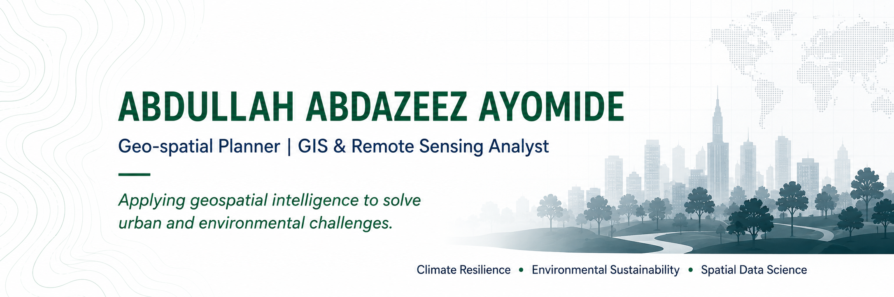

  

I am a **Geo-spatial Planner** and **GIS & Remote Sensing Analyst** applying Earth observation, spatial analysis, machine learning, and modelling to urban and environmental planning challenges. My work focuses on producing clear, reproducible evidence for climate resilience, sustainable development, disaster-risk reduction, and spatially informed decision-making.

### Research focus

**Geo-spatial planning · Climate resilience · Environmental sustainability · Remote sensing and Earth observation · Spatial data science · Disaster-risk assessment · Urban accessibility and spatial equity**

### Selected geospatial work

| Project | Technical contribution |
|---|---|
| **Ibadan Land-Use and Land-Cover Change, 2013–2023** | Applied Random Forest classification and change detection to quantify metropolitan land transformation; the 2023 classification achieved **97.0% overall accuracy** and **0.96 Kappa**. |
| **Abuja Urban Growth Prediction** | Modelled observed and future urban expansion using a **CA–Markov** framework; validation achieved **97.8% overall accuracy** and **0.97 Kappa**. |
| **Lagos Public Transport Accessibility and Spatial Equity** | Integrated population and transport-network data to estimate travel-time accessibility; approximately **46.56%** of the analysed population was classified as underserved. |
| **Ayetoro Coastal Erosion and Settlement Vulnerability** | Combined shoreline-change analysis and settlement buffers; erosion rates ranged from **−6.84 to −9.68 m/year**, with about **167.75 ha** of land loss. |
| **Machine-Learning Land Suitability — Enugu** | Integrated terrain, land cover, accessibility, environmental constraints, and machine-learning methods to identify suitable areas for sustainable urban development. |
| **Conflict, Displacement and Settlement Change — Borno** | Integrated conflict events, displacement records, night-time lights, and settlement data to assess spatial patterns of decline, abandonment, and recovery. |

*Repositories will be linked here as each project is prepared and published.*

### Technical expertise

| Area | Tools and methods |
|---|---|
| **GIS and mapping** | QGIS, ArcGIS/ArcMap, Google Earth Engine |
| **Programming and automation** | Python, GeoPandas, Rasterio, Pandas, NumPy, Scikit-learn, OSMnx |
| **Remote sensing** | Landsat, Sentinel, MODIS, Dynamic World, CHIRPS, WorldPop |
| **Spatial analysis** | Land-cover classification, change detection, network analysis, CA–Markov, MCDA/AHP, accessibility modelling, vulnerability assessment |
| **Research workflow** | Google Colab, VS Code, Git, GitHub, SPSS, Zotero |

### Current focus

I am building an open and reproducible collection of applied geospatial studies that connect technical analysis with practical urban, environmental, and climate-planning decisions.

### Connect

- **LinkedIn:** [Abdazeez Abdullah](https://ng.linkedin.com/in/abdazeez-abdullah-4b814719a)
- **Email:** [abdazeezabdullah1@gmail.com](mailto:abdazeezabdullah1@gmail.com)
- **Location:** Nigeria

---

**Applying geospatial intelligence to solve urban and environmental challenges.**
